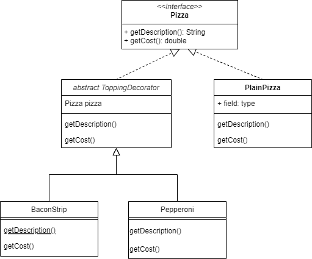
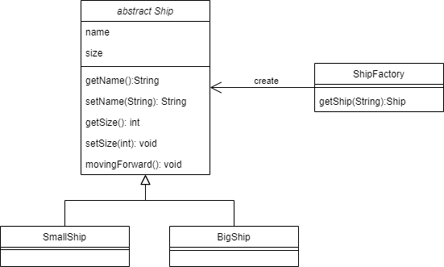
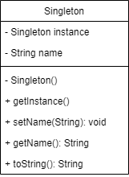
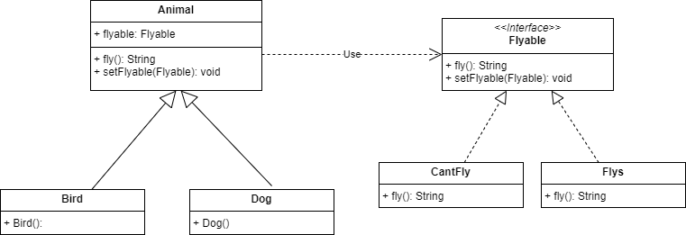
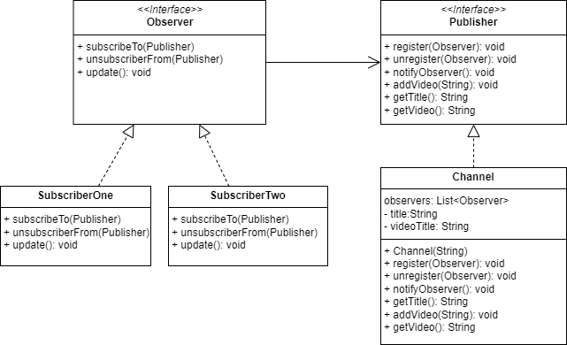
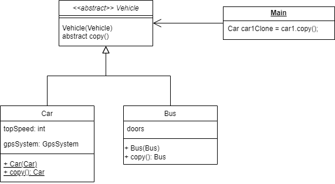

# 5 must-know design patterns

### Decorator Pattern
Source Code: `brin/example/design/pattern/designpatterexample/decorator`  

### Factory Pattern
Source Code: `brin/example/design/pattern/designpatterexample/factory`  

### Singleton Pattern
Source Code: `brin/example/design/pattern/designpatterexample/singleton`  

### Strategy Pattern
Source Code: `brin/example/design/pattern/designpatterexample/strategy`  

### Observer Pattern
Source Code: `brin/example/design/pattern/designpatterexample/observer`  

### Prototype Pattern
Source Code: `brin/example/design/pattern/designpatterexample/prototype`  
